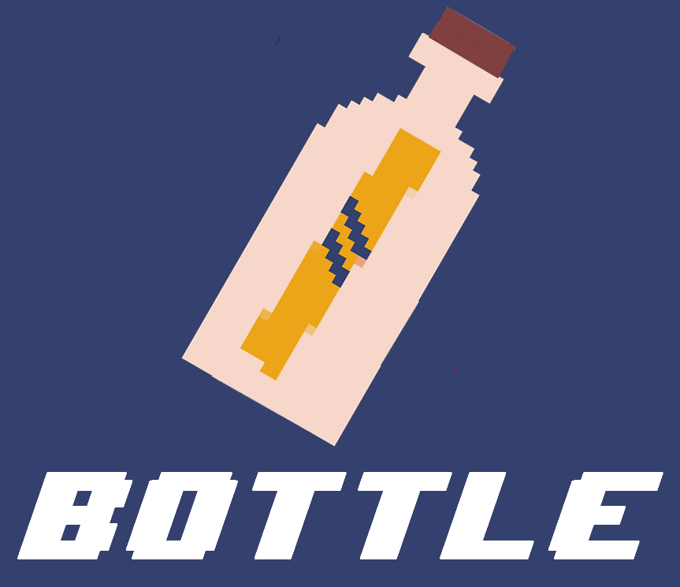
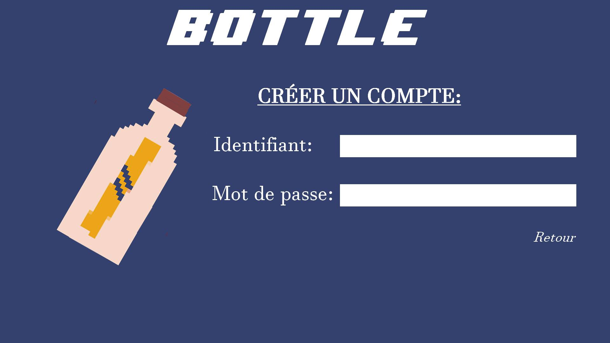
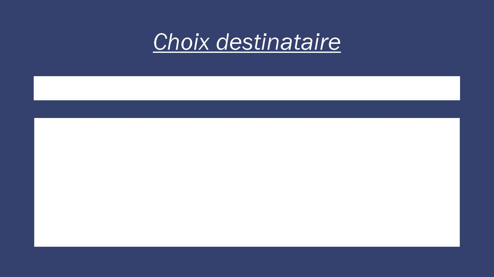
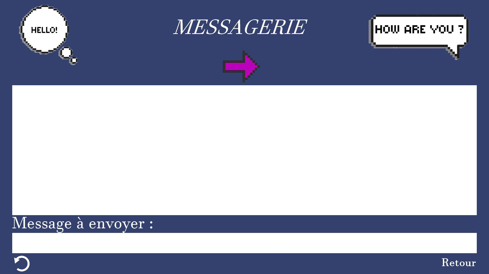

# ProjetC2_Blockchain

**BOTTLE : Une messagerie sécurisée écrite en C. Utilise uniquement : C, SDL, OPENSSL, TTF.**

Cette application est une simulation de messagerie qui fonctionne grâce aux blockchains. 
Assurant ainsi la sécurité des messages transmis, l’application permet aussi la création et la gestion de comptes dont les informations confidentielles sont chiffrées.

Installation
------------

### 1. Télécharger le code

### 2. Installer les librairies :

- sudo apt-get install libsdl1.2-dev
- sudo apt-get install libsdl2-ttf-dev
- sudo apt-get install libsdl2-image-dev
- sudo apt-get install libssl-dev  

### 3. Executer le code une fois compilé:

- aller dans le dossier src
- make all
- make runServeur (lance le serveur sur le port 2000)
- make runClient (lance le client en localhost sur le port 2000)

### 4. Fonctionnalités :

- Créer un nouveau compte : Vous pouvez créer un compte en écrivant votre identifiant et votre mot de passe

Cependant, il est seulement possible de créer 5 comptes différents.
Il n'y a pas de bouton pour supprimer un compte : il faut directement supprimer la ligne correspondante dans le fichier SaveID.log

- Se connecter :  Pour vous connecter il vous suffit de rentrer les identifiants préalablement crées. En cas d'erreur, appuyez sur le bouton retour

- Choisir un destinataire : Rentrez directement le nom du destinataire que vous souhaitez parmi les choix proposés

- Envoyer des messages : Communiquez directement avec les autres utilisateurs via la messagerie qui affichera les derniers messages de la conversation. Vous pouvez rafraichir la page en appuyant sur la flèche en bas à gauche. Si vous voulez changer de destinataire, appuyez sur le bouton retour et reconnectez-vous

